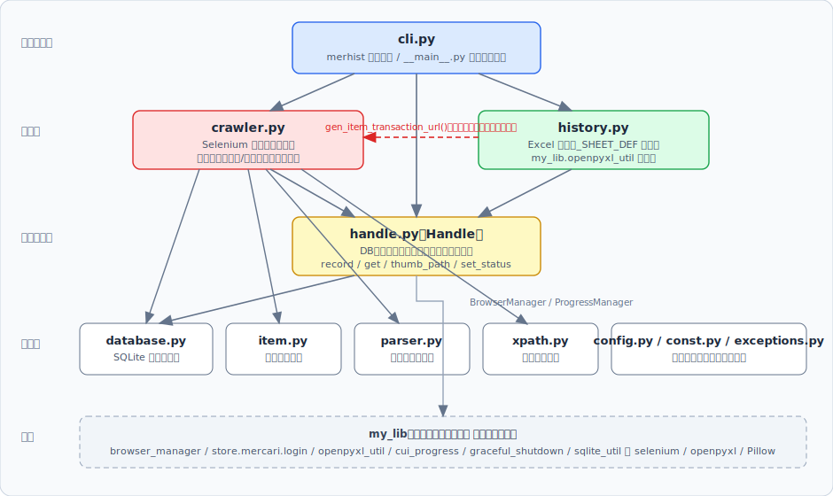
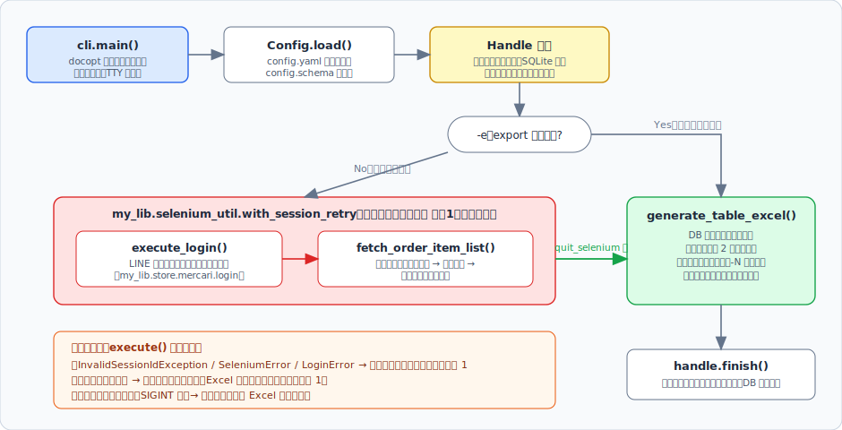
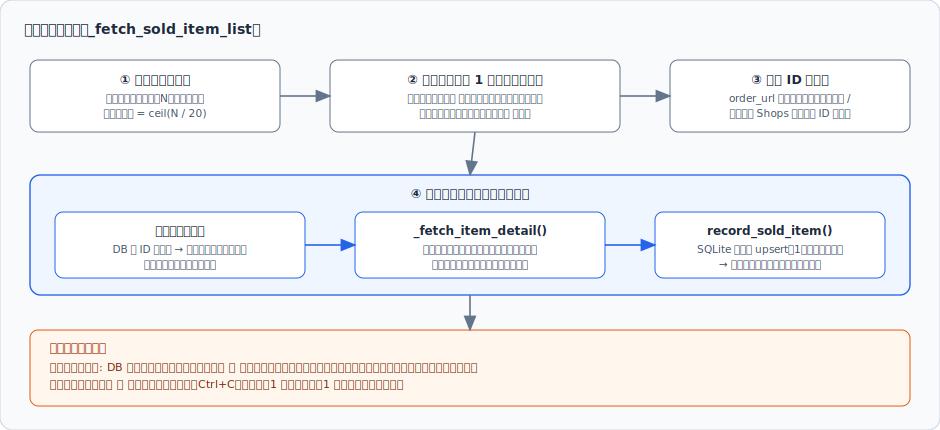
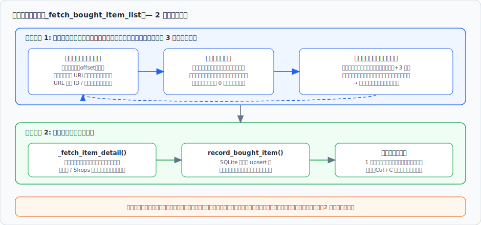
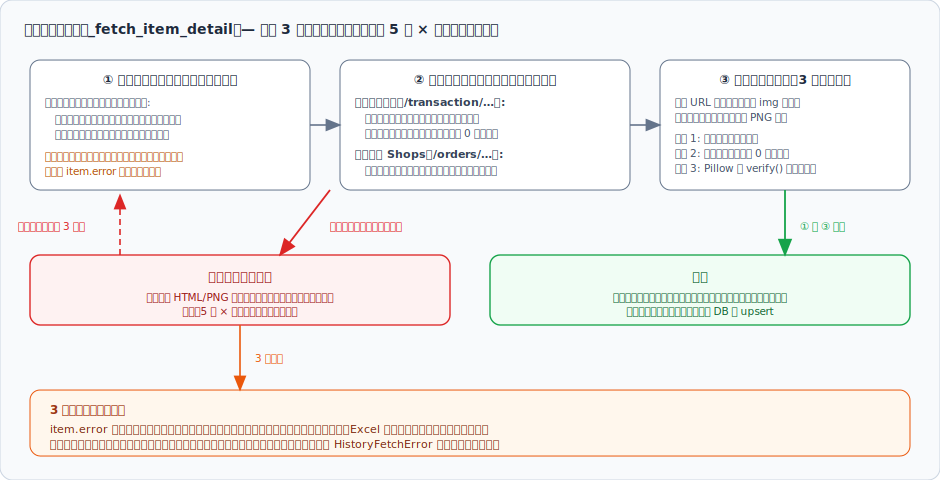
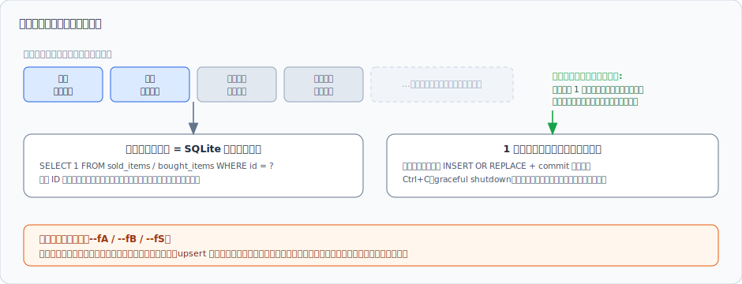
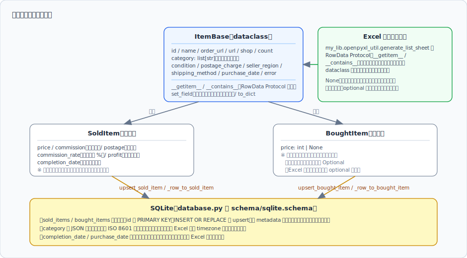
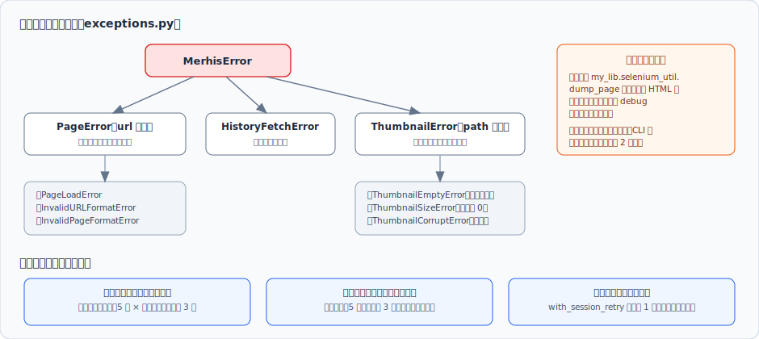

# アーキテクチャ解説

merhist-python の内部構造を解説します。メルカリの販売履歴・購入履歴を Selenium で収集し、SQLite にキャッシュした上で、サムネイル付きの Excel ファイルとして出力するツールです。

## 目次

- [ディレクトリ構成](#ディレクトリ構成)
- [モジュール構成と依存関係](#モジュール構成と依存関係)
- [実行フロー](#実行フロー)
- [データ収集の詳細](#データ収集の詳細)
- [増分更新と中断再開](#増分更新と中断再開)
- [データモデルと永続化](#データモデルと永続化)
- [Excel 生成](#excel-生成)
- [エラー処理とリトライ戦略](#エラー処理とリトライ戦略)
- [設定管理](#設定管理)
- [外部依存（my_lib）](#外部依存my_lib)
- [テスト構成](#テスト構成)

## ディレクトリ構成

```
src/merhist/
├── __main__.py         # python -m merhist 用エントリ
├── cli.py              # CLI エントリポイント（merhist コマンド）
├── config.py           # 設定管理（frozen dataclass）
├── const.py            # 定数（URL・ページサイズ等）
├── crawler.py          # Web スクレイピング（Selenium）
├── database.py         # SQLite アクセス層
├── exceptions.py       # カスタム例外
├── handle.py           # 状態管理（Handle クラス）
├── history.py          # Excel 生成
├── item.py             # データモデル（SoldItem / BoughtItem）
├── parser.py           # テキストパース関数（Selenium 非依存）
├── xpath.py            # XPath セレクタ集約
└── py.typed            # PEP 561 マーカー

schema/
├── config.schema       # config.yaml の JSON Schema
└── sqlite.schema       # SQLite テーブル定義

tests/
├── conftest.py
└── unit/               # ユニットテスト
```

エントリポイントは 3 系統あります。

| 起動方法 | 実体 | 用途 |
|---|---|---|
| `merhist` コマンド | `merhist.cli:main`（pyproject.toml の `[project.scripts]`） | 通常利用 |
| `python -m merhist` | `__main__.py` → `merhist.cli.main()` | 通常利用 |
| `crawler.py` / `history.py` 直接実行 | 各ファイル末尾の `__main__` ブロック | 開発時の単機能デバッグ（収集のみ / Excel 生成のみ） |

## モジュール構成と依存関係



| モジュール | 責務 |
|---|---|
| `cli.py` | オプション解析（docopt）、ログ初期化、セッションリトライを含む全体制御、終了コード決定 |
| `crawler.py` | ログイン、販売・購入履歴の一覧解析、商品詳細・サムネイルの取得 |
| `history.py` | シート定義 `_SHEET_DEF` に基づく Excel 生成（実処理は `my_lib.openpyxl_util` に委譲） |
| `handle.py` | アプリケーション状態のハブ。DB・ブラウザ（BrowserManager）・プログレスバー（ProgressManager）を保持し、各処理に仲介する |
| `database.py` | SQLite への upsert / 取得 / 存在確認 / メタデータ管理 |
| `item.py` | `ItemBase` / `SoldItem` / `BoughtItem` dataclass |
| `parser.py` | 価格・日付・件数などのテキストパース。Selenium 非依存の純粋関数で、単体テスト可能 |
| `xpath.py` | メルカリのページ要素を特定する XPath を集約。UI 変更時はこのファイルのみ修正すればよい設計 |
| `config.py` | 設定の frozen dataclass 群と、`base_dir` 起点のパス解決プロパティ |
| `const.py` | URL テンプレート、1 ページあたり件数（20）、デバッグダンプ ID 生成 |
| `exceptions.py` | `MerhisError` を頂点とするカスタム例外階層 |

依存の方向は「エントリ層 → 処理層 → 状態管理層 → 基盤層」の一方向です。例外は `history.py` → `crawler.py` の参照で、これは販売シートの「注文番号」列のハイパーリンク（`link_func`）で取引ページ URL を生成する `gen_item_transaction_url()` を使うためだけに存在します。

## 実行フロー



`cli.execute()` が全体を制御します。

1. **Handle 生成** — 各種ディレクトリの作成、SQLite 接続、メタデータ（総件数カウンタ）の復元を行います。
2. **収集**（`-e` 指定時はスキップ）— `my_lib.selenium_util.with_session_retry` 経由で `_execute_fetch()` を実行します。ブラウザセッション断（`InvalidSessionIdException`）の場合は最大 1 回、ドライバを作り直してリトライします（`-R` 指定時はプロファイル削除も実施）。
3. **Excel 生成** — 収集でエラーが発生した場合でも、それまでに DB へ保存できた分で Excel 生成に進みます（終了コードは 1 になります）。
4. **終了処理** — `handle.finish()` でドライバ終了・プログレスバー停止・DB クローズ。非デバッグ時は Enter 入力を待ってから終了します。

ログインは `my_lib.store.mercari.login.execute()` に委譲しており、LINE 認証・CAPTCHA の Slack 連携（設定時）はライブラリ側で処理されます。

## データ収集の詳細

販売履歴と購入履歴はページ構造が異なるため、収集方式も異なります。

### 販売履歴（ページネーション形式）



- 一覧はテーブル形式で、ページング表示「全 N 件」から総件数を取得し、1 ページ 20 件として総ページ数を計算します。
- 一覧テーブルの時点で価格・手数料・送料・手数料率・回収金額・取引完了日が取得できるため、詳細ページで補完するのはカテゴリ・商品状態・購入日時・サムネイル等です。
- 商品 ID は行の注文 URL から正規表現で抽出し、通常メルカリ（`mercari.com` / `m` 始まりの ID）とメルカリ Shops（`mercari-shops.com`）を判別します。

### 購入履歴（無限スクロール形式）



- 一覧が「もっと見る」ボタンによる無限スクロール形式のため、**フェーズ 1 で一覧を最後まで（または新規がなくなるまで）収集してから、フェーズ 2 で各アイテムの詳細を取得**する 2 段階方式です。
- 「もっと見る」クリック後はローディングアイコンの消滅を待ち、さらに 3 秒待機してから、前回読み取り位置（offset）以降の項目だけを解析します。

### 商品詳細の取得（共通）



`_fetch_item_detail()` は販売・購入共通で、1 アイテムにつき次の 3 ステップを実行します。

1. **商品説明ページ**（別タブで開閉）— 「商品の情報」欄からカテゴリー（パンくずのリンク列）・商品の状態・配送料の負担・発送元の地域・配送の方法を取得。ページが削除済み・非公開の場合は `item.error` に理由を記録して続行します。
2. **取引ページ** — 通常メルカリでは購入日時（必須。欠落時は `InvalidPageFormatError`）・商品代金・配送料を取得し、「送料込み」表記の場合は 0 円として扱います。メルカリ Shops では取引情報欄から価格を取得します。
3. **サムネイル保存** — 画像 URL を別タブで開いて `` 要素のスクリーンショットを PNG 保存し、「データが空でないか」「ファイルサイズが 0 でないか」「Pillow の `verify()` で破損していないか」の 3 段階で検証します。

## 増分更新と中断再開



このツールの中核となる設計です。

- **キャッシュ判定は商品 ID 単位** — 詳細取得の前に SQLite への存在確認を行い、取得済みならスキップします。
- **1 件ごとに即時コミット** — 詳細取得のたびに `INSERT OR REPLACE` + commit するため、中断・クラッシュしても直前までの成果が残ります。
- **新しい順を利用した打ち切り** — 履歴一覧は新しい順に並ぶため、継続モード（デフォルト）では「新規アイテムが 1 件もないページ／読み込み」に達した時点で、それ以降は取得済みとみなして打ち切ります。
- **安全な中断** — `fetch_order_item_list()` の開始時に `my_lib.graceful_shutdown` のシグナルハンドラを設定し、ページ単位・アイテム単位でシャットダウン要求を確認します。Ctrl+C で中断しても、その時点までのデータで Excel 生成に進みます。
- **強制再収集**（`--fA` / `--fB` / `--fS`）— キャッシュ判定と打ち切りを行わず全アイテムを再取得し、upsert で既存レコードを上書きします。

メタデータ（`sold_total_count` / `bought_total_count` / `last_modified`）も `metadata` テーブルに保存され、次回起動時に `Handle` へ復元されます。

## データモデルと永続化



- `ItemBase` は共通フィールド（ID・商品名・URL・カテゴリ・購入日時・エラーなど）を持つ dataclass で、`SoldItem`（手数料・回収金額・取引完了日など）と `BoughtItem`（価格のみ追加。取得できない場合があるため `int | None`）が継承します。
- `ItemBase` は `__getitem__` / `__contains__` を実装しており、`my_lib.openpyxl_util` の `RowData` Protocol を満たします。このため Excel 生成時に辞書へ変換せず dataclass のまま渡せます。`__contains__` は「値が `None` または空リストならキーなし」と扱い、Excel の optional 列の空欄表示に利用されます。
- `set_field()` はフィールド名を検証してから代入するユーティリティで、XPath 解析結果を列定義（名前の文字列）経由で流し込む際のタイポを実行時に検出します。
- SQLite には `sold_items` / `bought_items` / `metadata` の 3 テーブルがあり、スキーマは `schema/sqlite.schema` で定義されます。`category` は JSON 文字列、日時は ISO 8601 文字列として格納し、読み出し時に dataclass へ復元します（Excel が timezone 付き datetime を扱えないため、timezone は除去されます）。

## Excel 生成

`history.py` の `generate_table_excel()` が担当します。

- シートは **【メルカリ】購入** と **【メルカリ】販売** の 2 枚で、列構成は `_SHEET_DEF` 辞書で宣言的に定義されています（列位置・幅・表示形式・折り返し・ハイパーリンク生成関数など）。実際のシート描画は `my_lib.openpyxl_util.generate_list_sheet()` に委譲します。
- `formal_key` により、他ショップ向けツールと共通のキー名をメルカリの実フィールドに読み替えます（例: `date` → `purchase_date`、`no` → `id`）。
- 「商品ID」列は商品説明ページへ、「注文番号」列は注文・取引ページへのハイパーリンクになります。
- サムネイルはキャッシュディレクトリの `{商品ID}.png` をセルに埋め込みます（`-N` 指定時は省略され、行の高さも低くなります）。
- ワークブックの標準フォントは設定ファイル（`output.excel.font`）から反映されます。
- 欠損フィールドがある場合は「⚠️ 日付 商品名: メッセージ」形式の警告ログを出しつつ生成を続行します。

## エラー処理とリトライ戦略



例外は `MerhisError` を頂点に、URL 情報を持つ `PageError` 系、`HistoryFetchError`、ファイルパス情報を持つ `ThumbnailError` 系に分かれます。

リトライは対象の特性ごとに 3 種類を使い分けています。

| 対象 | 方式 | 実装 |
|---|---|---|
| 商品詳細（個別リソース） | 待機時間を試行回数に応じて増加（5 秒 × 試行回数）、最大 3 回。失敗のたびにページをデバッグダンプ | `crawler._fetch_item_detail` |
| 購入履歴一覧（ページ全体） | 固定間隔 5 秒、最大 3 回。最終回の失敗は再送出 | `crawler._fetch_bought_item_info_list` |
| ブラウザセッション断 | ドライバを作り直して最大 1 回リトライ | `cli.execute` の `with_session_retry` |

詳細取得に 3 回失敗したアイテムは `item.error` にメッセージを設定したまま DB に記録され、収集全体は継続します（Excel の「エラー」列に出力されます）。ただし**ページの最初のアイテムで失敗した場合**は、ページ自体やセッションに問題がある可能性が高いため `HistoryFetchError` で収集を停止します。

## 設定管理

- `config.yaml` は読み込み時に `schema/config.schema`（JSON Schema）で検証され、`Config.load()` で frozen dataclass ツリーに変換されます。
- ファイルパスはすべて `base_dir` を起点に `Config` のプロパティとして解決されます。

| プロパティ | 設定キー | 内容 |
|---|---|---|
| `cache_file_path` | `data.mercari.cache.order` | SQLite キャッシュ DB |
| `thumb_dir_path` | `data.mercari.cache.thumb` | サムネイル画像ディレクトリ |
| `selenium_data_dir_path` | `data.selenium` | Chrome プロファイル |
| `debug_dir_path` | `data.debug` | デバッグダンプ出力先 |
| `captcha_file_path` | `output.captcha` | CAPTCHA 画像 |
| `excel_file_path` | `output.excel.table` | 生成する Excel ファイル |

- Slack 設定は任意で、CAPTCHA 対応可能な構成（または設定なし）のみを受け付けます。
- デバッグモード（`-D`）では本番キャッシュ DB の代わりにデバッグ専用 DB（ファイル名に `_debug` を付与、毎回リセット）を使い、各ループを 1 件処理で打ち切ります。

## 外部依存（my_lib）

共通処理は作者の共通ライブラリ [my-py-lib](https://github.com/kimata/my-py-lib) に集約されており、本リポジトリはメルカリ固有のロジックに専念しています。

| my_lib モジュール | 用途 |
|---|---|
| `browser_manager.BrowserManager` | Chrome（undetected-chromedriver）の起動・プロファイル管理 |
| `store.mercari.login` | LINE 認証を含むメルカリログイン、CAPTCHA の Slack 連携 |
| `selenium_util` | ページダンプ、別タブ操作（`browser_tab`）、セッションリトライ |
| `openpyxl_util.generate_list_sheet` | シート定義辞書からの Excel 生成本体 |
| `cui_progress.ProgressManager` | Rich ベースのプログレスバー・ステータス表示 |
| `graceful_shutdown` | シグナルハンドラによる安全な中断 |
| `sqlite_util` | スキーマファイルからのテーブル作成 |
| `config` / `logger` / `time` / `pretty` | 設定読み込み（Schema 検証）・ログ・タイムゾーン付き現在時刻・整形出力 |

## テスト構成

- `tests/unit/` に約 5,000 行のユニットテストがあり、モジュール単位（crawler / database / handle / history / config / parser / item / xpath / cli 等）で分かれています。Selenium 依存箇所はモックで代替します。
- pytest は並列実行（`--numprocesses=auto`）・タイムアウト 300 秒で動作し、カバレッジレポートを `reports/` に出力します。
- 型チェックは mypy・pyright・ty の 3 種を CI と pre-commit で実行します。
